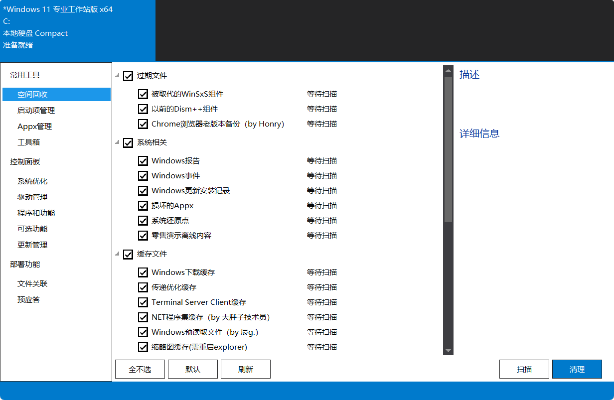
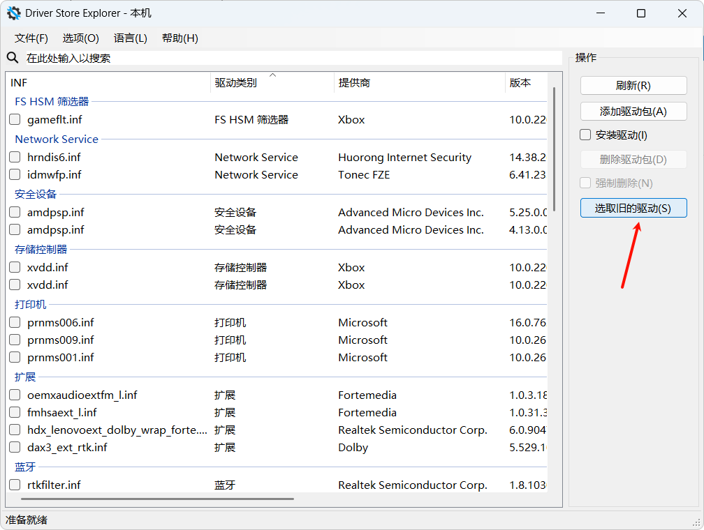

# 电脑C盘清理

## 1. Dism++

使用Dism++清理一下

## 2. Rapr

使用 Rapr 清理旧驱动

- [Github链接](https://github.com/lostindark/DriverStoreExplorer)

> 有时候也没有旧驱动

## 3. Windows 磁盘清理

Win10：

- 右键**C盘**，点击**属性**
- 点击【磁盘清理】

Win11的磁盘清理打开方式:

1. `win+r`打开**运行**
2. 输入`cleanmgr`
3. 选择**C盘**清理

## 修改存储路径

- 修改QQ、微信的存储路径

- 修改虚拟内存到D盘（其他盘）

- 修改【桌面】【下载】等系统文件夹路径到D盘（其他盘）

## 卸载

卸载不需要的软件

推荐使用【Hibit uninstaller】和【geek】卸载工具

## 其他工具

### WizTree

磁盘扫描工具，只是扫描，还是不知道怎么清理，对于非专业者有点鸡肋。

- [WizTree官网](https://diskanalyzer.com/)

