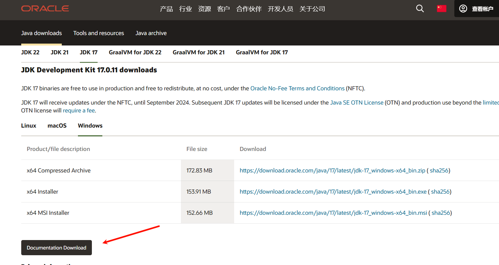

# 介绍
---
Java 是由 Sun Microsystems 公司于 1995 年 5 月推出的 Java 面向对象程序设计语言和 Java 平台的总称。由 James Gosling和同事们共同研发，并在 1995 年正式推出。

后来 Sun 公司被 Oracle （甲骨文）公司收购，Java 也随之成为 Oracle 公司的产品。

Java分为三个体系：

- JavaSE（J2SE）（Java2 Platform Standard Edition，java平台标准版）  
- JavaEE(J2EE)(Java 2 Platform,Enterprise Edition，java平台企业版)  
- JavaME(J2ME)(Java 2 Platform Micro Edition，java平台微型版)。  
2005 年 6 月，JavaOne 大会召开，SUN 公司公开 Java SE 6。此时，Java 的各种版本已经更名，以取消其中的数字 "2"：J2EE 更名为 Java EE，J2SE 更名为Java SE，J2ME 更名为 Java ME。

---

## 下载

点击[java官网](https://www.oracle.com/cn/java/),前往下载.

点击坐上角的**下载java**，选择对应的版本和系统。
> 下载官方文档:
> 
> 找到下载程序下面一点的"Documentation Download"按钮即可下载文档.(英文的)

---

# java学习路径

> 借鉴鱼皮
>
> 原地址：[Java 学习路线 by 程序员鱼皮 | 鱼皮的编程宝典 (codefather.cn)](https://www.codefather.cn/java学习路线-by-程序员鱼皮/#符号表)

## java语言基础

- Java特点/背景
- Java环境搭建
- IDEA
- [x] Java基础语法
    - 数据类型
    - 流程控制
- [x] 数组
- [x] 面向对象 
    - 方法
    - 重载
    - 继承
    - 多态
- [x] 抽象类
- 接口
- 枚举
- 常用类
    - String
    - 日期时间
- 集合类
- 泛型
- 注解
- 异常处理
- 多线程
- IO流
- 反射

## Java 8

- Stream API
- Lambda 表达式
- 新日期时间 API
- 接口默认方式

## 数据结构与算法

## 操作系统

- 操作系统的组成
- 进程、线程
- 进程线程之间的通信方法
- 进程调度算法
- 死锁
- 内存管理

## 计算机网络

- 网络分层模型
- 网络传输过程
- IP、端口
- HTTP / HTTPS协议
- UDP / TCP协议
- ARP 地址解析协议
- 网络安全
- DNS 域名解析

## MySQL

- 基本概念
- MySQL搭建
- SQL语句编写
- 约束
- 索引
- 事物
- 锁机制
- 设计数据库表
- 性能优化

---

# 资源扩展

- **文档**
    - [Java 文档_w3cschool](https://www.w3cschool.cn/java/dict)