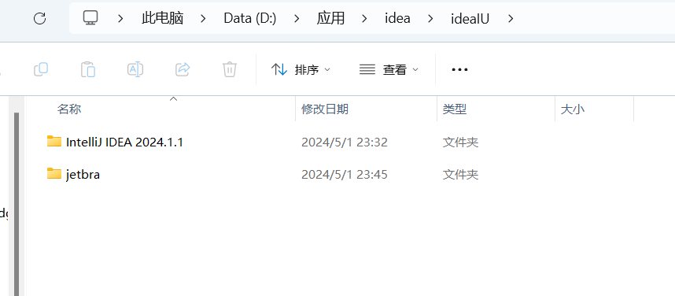
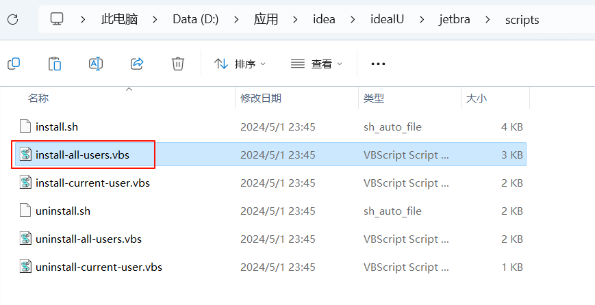
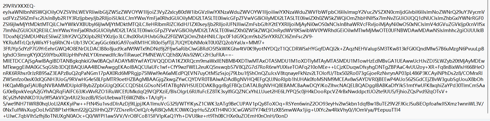
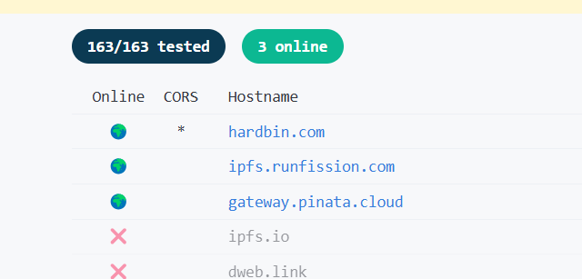
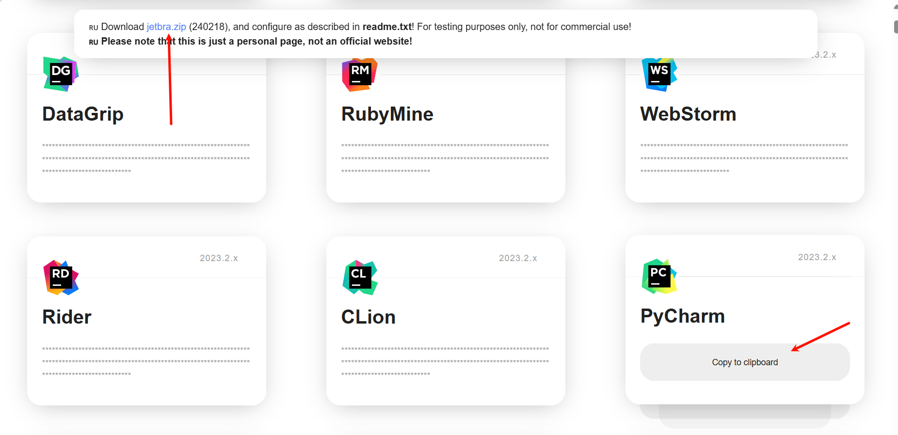

# idea


## 下载

[下载 IntelliJ IDEA – 领先的 Java 和 Kotlin IDE (jetbrains.com)](https://www.jetbrains.com/zh-cn/idea/download/?section=windows)

傻瓜式安装即可


## 破解idea

> 本次使用的24.1.1版本

先下载工具

> 链接: https://pan.baidu.com/s/1GbvGoS1PT_yIyMOoxb0NNQ?pwd=e3ua 提取码: e3ua 复制这段内容后打开百度网盘手机App，操作更方便哦


推荐和idea的安装目录在一起




### 开始激活

> 点击`jetbra -> scripts -> install-all-users.vbs`
>
> 如图所示:
>
> 


***点击后会有弹窗，提示等待2-3分钟左右，你就静静的等待，完成后会有弹窗出现，点击DONE即可***

### 输入激活码

> **激活码在`jetbra/readme.txt`**
>
> 

***复制粘贴到idea即可***


# 其他JetBrains产品编辑器激活


1. 首先进入网站


进入[神秘网站](https://3.jetbra.in/)


找到`Online`和`CORS`，一个Online是地球🌏，CORS是 * 星号的网站，进去！




进到网站



> 点击上面蓝色字体的**jetbra.zip**可以下载到`jetbra.zip`（就是我们获取idea激活码的哪个软件）

```txt
操作指南:
1. 添加-javaagent:/path/to/ja-netfilter.jar=jetbrains到你的vmoptions(手动或自动)
2. 在` Licenses `窗口注销jb账户
3. 在https://jetbra.in/5d84466e31722979266057664941a71893322460页面上使用key
4. 插件` mymap `从2022.1版本起已弃用
5. 不用关心激活时间，它是备用license，不会过期

喜欢它~

JBR17:
将这两行添加到您的vmoptions文件:(对于手动，没有任何空白字符)
——add-opens = java.base / jdk.internal.org.objectweb.asm = ALL-UNNAMED
——add-opens = java.base / jdk.internal.org.objectweb.asm.tree = ALL-UNNAMED

新:
自动配置vmoptions:
macOS或Linux:执行"scripts/install.sh"
Windows:双击执行脚本\install-current-user。vbs”(针对当前用户)
“脚本\ install-all-users。vbs”(针对所有用户)
```


打开网站之后，点击对应的软件`Copy to clipboard`

即可复制激活码, 再到对应的软件激活.
