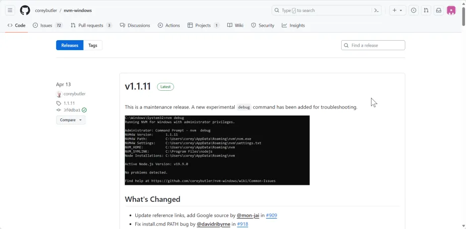
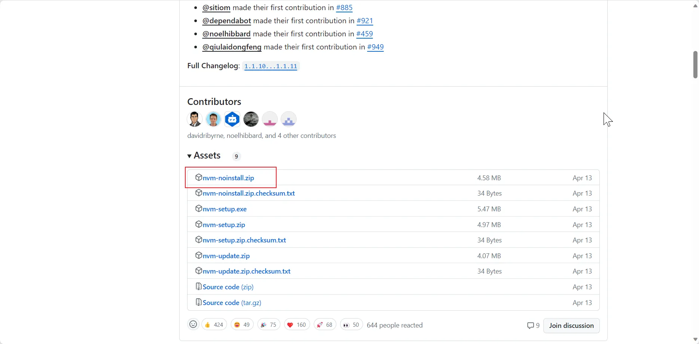
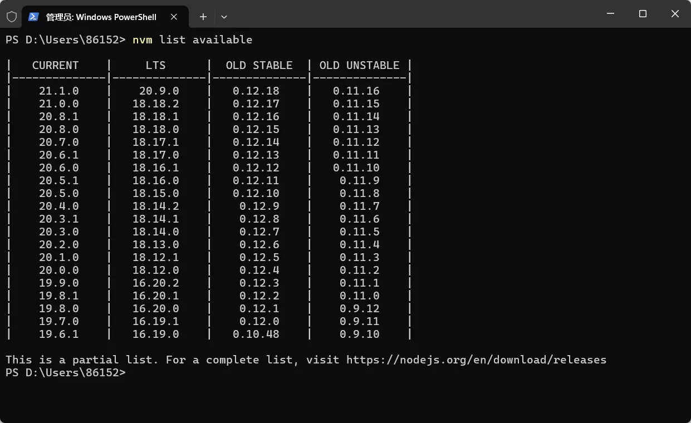
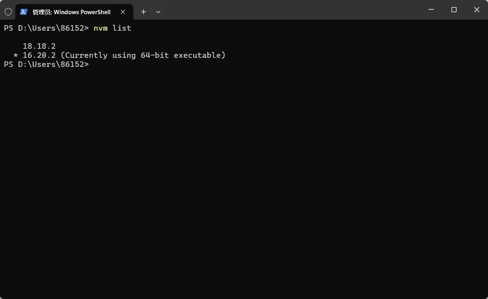

# nvm-windows的安装和使用

## 下载
有两种方式：
- 安装器安装
- 手动配置（推荐）
1. 安装器
差不多，看下面

2. 手动配置（推荐）
2.1. 下载`nvm-noinstall`文件
下载nvm项目文件，进行手动配置。进入[项目发布地址](https://github.com/coreybutler/nvm-windows/releases)。



下载`noinstall`版本



下载到一个新的文件夹。

> 我的文件夹是“my_nvm”，以下的步骤就用这个名字了

## 配置
### 配置环境变量
1. 右键“此电脑”，点击“属性”
2. 点击“高级系统设置”
3. 点击“环境变量”
4. 新建“系统变量”
   1. 设置变量名为NVM_HOME，变量值为nvm安装目录D:\my_nvm\nvm
   2. 设置变量名为NVM_SYMLINK

这里设置的是一个软连接，一个“不存在的目录”`D:\my_nvm\nodejs`，这是给`nvm`管理的

|变量名 |	变量值 |
|---|---|
| NVM_HOME	| D:\my_nvm\nvm |
| NVM_SYMLINK	| D:\my_nvm\nodejs |

添加到path变量下
```
%NVM_HOME%
%NVM_SYMLINK%
```

### 配置`nvm`的`settings.txt`文件
在`nvm`的安装目录下，新建一个文件`settings.txt`文件，这里是`nvm`的一些相关配置
```txt
root:D:\Apps\my_nvm\nvm
path:D:\Apps\my_nvm\nodejs
arch:64
proxy:none

node_mirror: https://npm.taobao.org/mirrors/node/
npm_mirror: https://npm.taobao.org/mirrors/npm/
```

> root：nvm的安装目录  
> path：你的nvm的软连接nodejs目录，也就是前面环境变量的NVM_SYMLINK  
> arch：系统架构64位或者32位  
> proxy：代理，不需要  
>   
> node_mirror: nvm下载node时候的镜像  
> npm_mirror：nvm下载npm时候的镜像  

::: danger 注意
2024/1/25 日：更改镜像，原来镜像不可用。  
node_mirror: https://cdn.npmmirror.com/binaries/node/  
npm_mirror: https://cdn.npmmirror.com/binaries/npm/
:::

### 安装node
现在东西准备好了。
准备下载`node`
进入终端输入`nvm -v`查看nvm是否可以正确使用，正常是出现**版本号**

输入`nvm list available`查看可下载的`node`版本！



输入`nvm install 16`：下载16大版本里最新的node版本。
输入`nvm install 18`：下载18大版本里最新的node版本。
也可以输入具体的版本号安装。
下载完成之后。
输入`nvm list`查看管理的所有`node`版本



输入`nvm use 16`，使用16大版本的`node`。（当然也可以使用具体的版本号）
上面`16.20.0`前面有一个`*` 号，表示当前使用的版本。
此时可以看到原本没有的`my_nvm\nodejs`目录也出现了

### 配置npm全局安装的包
正常不配置的话，切换node时，原本全局安装的npm包，切换之后没有了。
所以我们需要配置npm的全局安装包路径
我们直接在`my_nvm`目录下新建两个目录，与nvm目录和nodejs目录同级
- node_global
- node_cache

第一个`node_global`是全局包路径
第二个`node_cache`是npm包缓存的路径
```shell
npm config set prefix "D:\my_nvm\node_global"
npm config set cache "D:\my_nvm\node_cache"
```
可以使用以下命令查看
```shell
npm config get prefix 
npm config get cache 
```
修改global环境变量
将`"D:\my_nvm\node_global"`这个目录添加到环境变量`path`里面去。

### 切换npm镜像源
原本的npm是国外的，安装依赖很慢的。这里切换成国内的阿里镜像
使用以下命令：
```shell
npm config set registry https://registry.npmmirror.com
```
官网是：https://npmmirror.com/
查看当前镜像源命令：
```shell
npm config get registry
```


