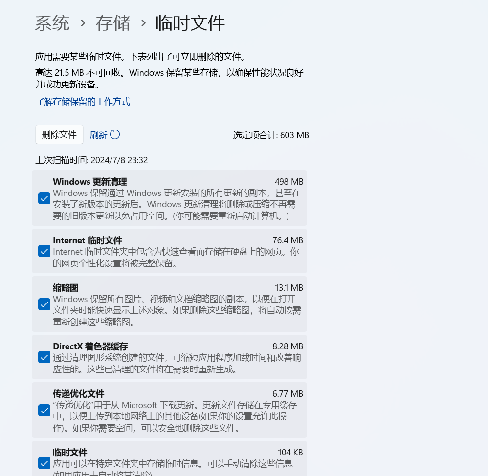

# 如何清理c盘


##  清理缓存文件

（虽然这步清理不了多少）

`win+r`打开**运行**， 输入`%temp%`进入缓存文件夹。

里面都是缓存文件，可以清理。

> 电脑玩单击游戏或者游戏缓存存档注意一下。有可能误清理


# 磁盘清理

win10可以直接在资源管理器里右键C盘，选择**磁盘清理**。

win11没有上面这些步了。需要在`系统 -› 存储 -› 临时文件`里**选择性清理**。如果没有特殊性需求都可以直接清理不会影响。




## 移动（桌面/文档/下载/之类的）文件夹

移动到C盘之外的其他的盘。

> 只有C盘不喜欢分盘的可以不需要这步


## 关于hiberfil.sys和pagefile.sys

### 1. hiberfil

`hiberfil`是系统的休眠文件。不需要休眠的，或者想暂时清理的可以在命令行输入

> 关闭休眠

```shell
powercfg -h off
```


> 打开休眠

```shell
powercfg -h on
```

### 2. pagefile

这是系统的分页占用

这是电脑虚拟内存占用的空间。普通玩家建议不用修改虚拟内存。