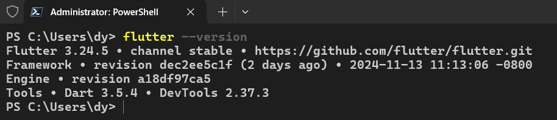

# 入门-环境搭建

---

> **相关链接**
>
> - 官网 （https://flutter.dev/）
> - 官网中文文档（https://docs.flutter.cn/get-started/install）


## SDK下载

在国内网络环境下搭建flutter环境，使用镜像站点。

1. 配置环境变量

**临时**在 Powershell 窗口配置变量：

配置`PUB_HOSTED_URL`和`FLUTTER_STORAGE_BASE_URL`

```powershell
C:> $env:PUB_HOSTED_URL="https://pub.flutter-io.cn"
```

```powershell
C:> $env:FLUTTER_STORAGE_BASE_URL="https://storage.flutter-io.cn"
```

**永久设置**，在 ”电脑 属性“ 里设置环境变量。（**推荐**）

2. 下载 Flutter SDK

[下载链接](https://docs.flutter.cn/release/archive?tab=windows)

在该页面里选择 Stable channel 稳定通道下载即可

3. 创建 Flutter 文件夹
4. 解压之前下载好的 Flutter SDK 压缩包，将SDK安装路径的 bin 目录添加到 PATH 环境变量中
5. 执行 `flutter doctor`命令来验证安装对应的开发环境（Android 和 IOS之类）

`flutter -version`来查看版本号，正确出现版本号，说明 Flutter SDK 已经正确安装好并配置好环境变量。




## 开发工具

- Git for windows 2.27+版本
- Android Studio （如要开发安卓APP）
- VSCode（安装好相关插件 flutter、dark），以下默认使用VSCode编辑器开发项目


## 真机调试（推荐）

通过**数据线连接**电脑和手机。

安卓手机开启 **USB调试** 和允许 **USB安装**。（通常在手机的开发者选项里开启）

在 **vscode** 里切换成真机


然后执行 `flutter run` 运行项目


## 无线调试（推荐）

- 电脑和手机连接同一个wifi
- 手机开启无线调试和USB调试
- 电脑在`Android Studio` 里连接手机(如果不使用AS开发, 而是使用VSCode开发的话,不推荐)

> **VSCode开发**推荐连接方式
>
> 使用命令行连接配对手机的**无线调试**:
>
> ```shell
> # ip地址:端口
> adb connect 192.168.xx.xx:31234
> ```
>
> 端口可以在 手机 -> 开发者模式 -> 无线调试界面 里看到完整的 **ip:port**


再vscode里切换真机，执行`flutter run`


## 运行调试

1. vscode

在vscode里运行项目可以使用命令行`flutter run`，但是不推荐。

推荐在vscode里的左侧功能栏的【运行和调试】里启动


这样启动可以有【断点】【reload】【restart】【open devtool browser】等功能。

2. Android Studio

直接选择好模拟器或者真机，选择main.dart，直接点击运行项目即可。